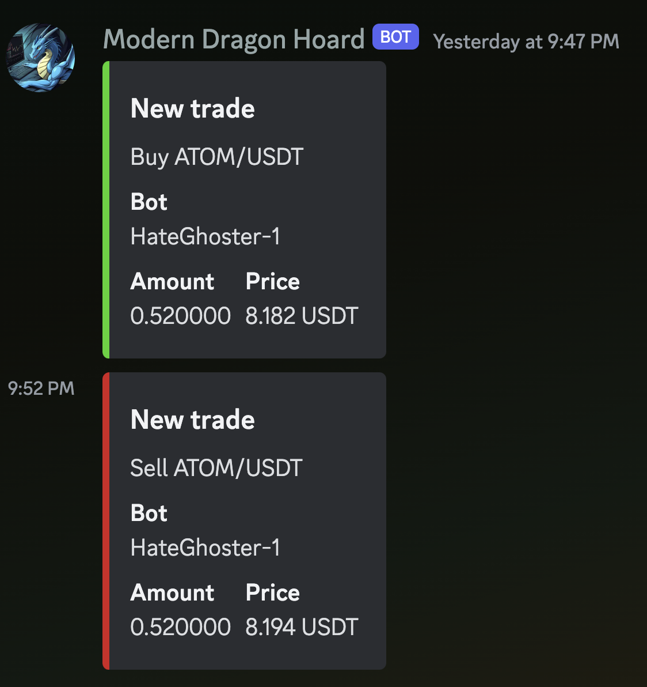

# Your trades live on Discord!

The bot works by reading HummingBot's trading CSV files using FSNotify, so that it automatically updates whenever a trade occurs, this is one of the most secure and least invasive ways to make a Discord bot for Hummingbot, especially a read-only one!

## How to set up

### Docker Compose

We build for both ARM and X86 servers

- Rename `docker-compose.template.yml` to `docker-compose.yml`. Feel free to adjust it as you wish (but not needed)
- Run `docker compose up` which will pregenerate a config for you...
- In https://discord.com/developers, create a bot and copy the bot token in the config file that is generated in `./mdh_discord`
- Create a channel on your server for trading updates, and copy the channel id in the config file (you may need to enable developer mode on Discord to be able to right click and copy the channel ID). Place this ID also in your new config file
- Add your bots! You can name them, make sure to point to the right trading csv file, so it can read your trades!
- Run `docker compose up -d` to run the bot as a server
- Invite your bot (it doesn't need admin rights): `https://discord.com/oauth2/authorize?client_id=<your bot client id>&permissions=515396455488&scope=bot` (add your client ID from the Discord Developers page)
